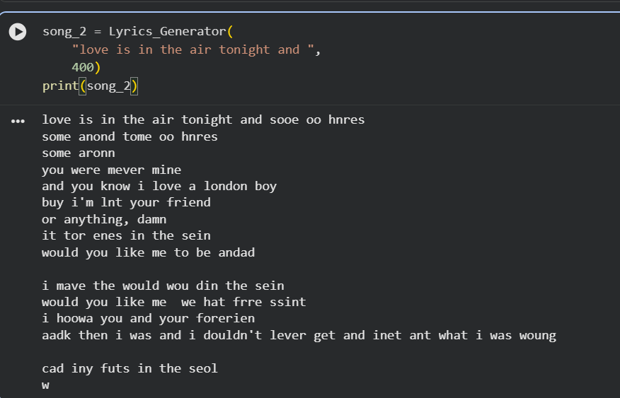
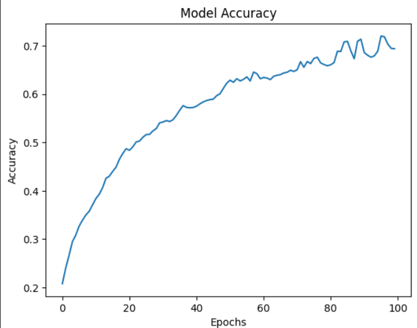

# 🎵 RNN Lyrics Generator

## 📌 Project Overview

This project is a Deep Learning based Lyrics Generator built using Recurrent Neural Networks (RNN).
The model learns word sequences from song lyrics data and generates new lyrics based on a user-provided starting sentence.

---

## 🚀 Features

* Text generation using RNN
* Sequential word prediction
* Custom seed text generation
* Deep Learning with TensorFlow/Keras
* NLP preprocessing and tokenization

---

## 🛠️ Technologies Used

* Python
* TensorFlow / Keras
* NumPy
* Pandas
* NLP
* Jupyter Notebook

---

## 📂 Project Structure

```bash
RNN_Lyrics_Generator/
│
├── RNN_Mini_Project_ipynb.ipynb
├── Songs.csv
├── README.md
└── output_images/
```

---

## 📊 Model Workflow

1. Load lyrics dataset
2. Clean and preprocess text
3. Tokenize lyrics
4. Create input sequences
5. Train RNN model
6. Generate new lyrics

---

## ▶️ Sample Output

### Input Seed Text

```python
"love is in the air tonight and "
```

### Generated Lyrics

```text
love is in the air tonight and it soe sias to you
i'm so sirhine io ohe what i can't have and don't be mede to tear
but i con't wann to the to the butu
```

---

## 📷 Output Screenshots



```

---

## 📈 Future Improvements

* Use LSTM instead of Simple RNN
* Increase dataset size
* Improve text coherence
* Add temperature sampling
* Train for more epochs

---

## 👨‍💻 Author

**Irfan78693**

GitHub: https://github.com/Irfan78693
